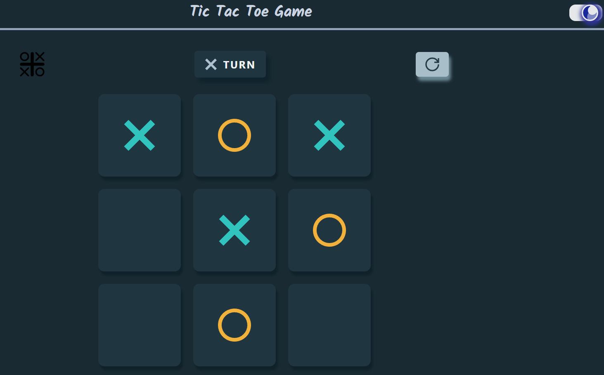

# 
Tic Tac Toe + React

Esta aplicación de Tic Tac Toe ha sido desarrollada utilizando React como parte de una práctica para mejorar las habilidades en el desarrollo web. Es una versión moderna y elegante del clásico juego de tres en raya, diseñada para ofrecer una experiencia de usuario intuitiva y divertida.

## Instalación

Sigue estos pasos para correr el proyecto localmente:

1. Clona este repositorio.
2. Navega hasta el directorio del proyeto.
3. Ejecuta `pnpm install` para instalar las dependencias.
4. Ejecuta `pnpm run dev` para iniciar el servidor.
